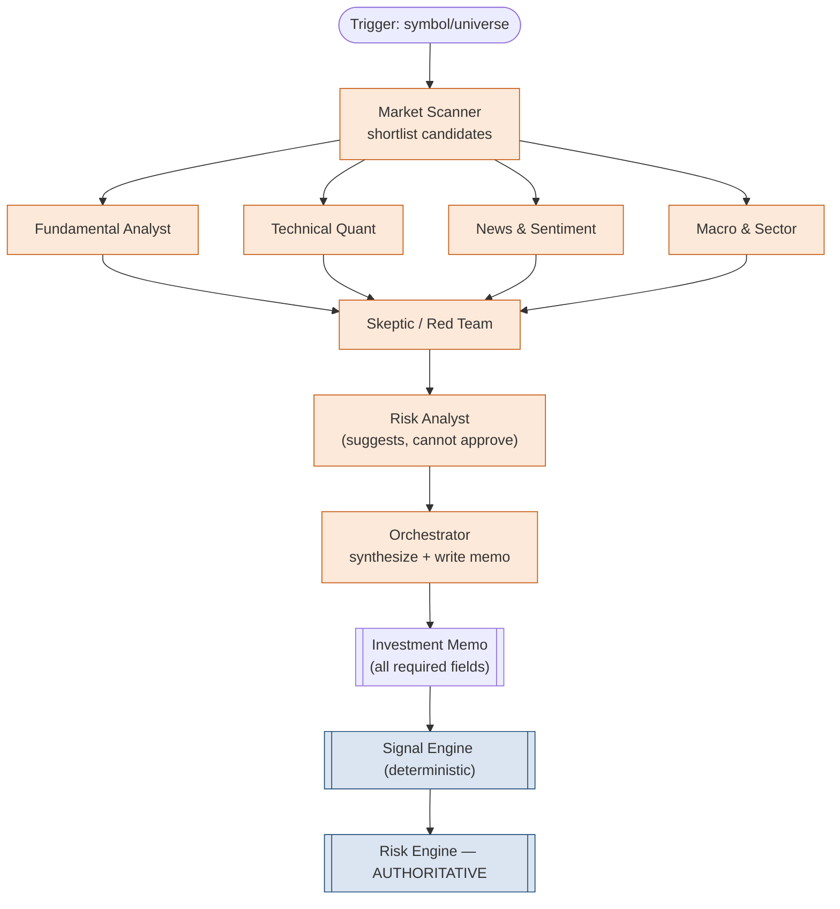
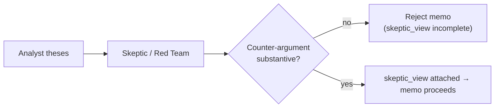
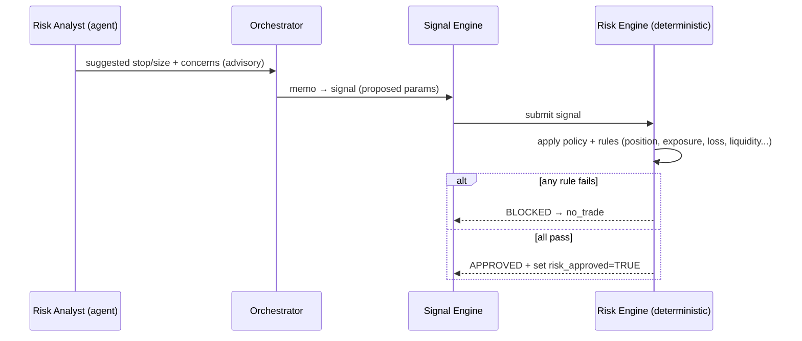
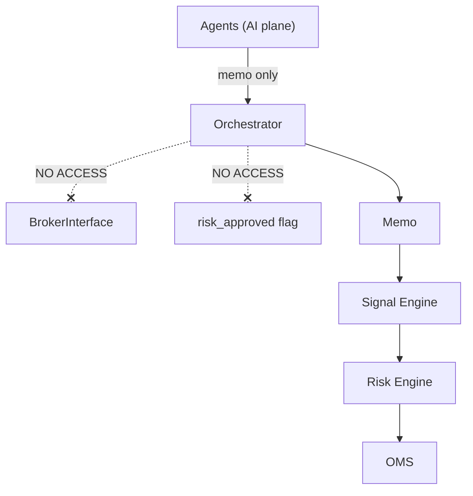
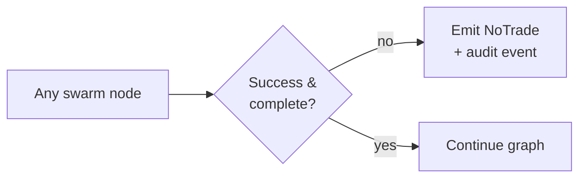

# Agent Architecture — Mesa Proprietária com IA

**Project:** Proprietary AI-Powered Trading Desk (owner capital only — not advisory).
**Companion to:** `system-architecture.md`, `technical-specification.md`, `data-architecture.md`.
**Status:** MVP. Mock-LLM first (Phase 3). Agents are **advisory only — they cannot execute trades.**

---

## 1. Design Overview — Multi-Agent Research Swarm (L07)

The research swarm is built on **LangGraph**: a stateful directed graph where each node is an agent operating on shared `SwarmState`. The swarm's only product is a structured **Investment Memo** — it never touches the broker, the risk approval flag, or the order book.

```
┌───────────────────────────────────────────────────────────────────┐
│   AI PLANE (advisory)        |        DETERMINISTIC PLANE (auth)    │
│                              |                                      │
│   Swarm → Memo → Signal  ====│====>  Validation → Backtest →        │
│   (proposes)                 |       Risk Engine (decides) → OMS    │
└───────────────────────────────────────────────────────────────────┘
                              ^
                  Hard boundary: agents stop here.
```

Each agent extends `agents/base_agent.py`, which provides: input contract, prompt loading (`agents/prompts/<agent>.md` + `prompt_version`), LLM invocation behind an interface, structured-output parsing, and mandatory recording of `model_version` / `prompt_version` on every output.

---

## 2. Orchestration Graph (LangGraph)



**Flow:** Scanner shortlists → four analysts work in parallel → Skeptic argues against the combined thesis → Risk Analyst annotates risk → Orchestrator synthesizes and writes the memo. The memo then crosses into the deterministic plane.

---

## 3. Per-Agent Contracts (8 MVP Agents)

Each agent has a fixed I/O contract. All outputs carry `model_version` and `prompt_version`.

### 3.1 Market Scanner — `agents/market_scanner.py`

| Aspect | Detail |
|--------|--------|
| Role | Shortlist tradable candidates from the universe |
| Inputs | Feature store snapshot (momentum, volatility, liquidity), universe list |
| Outputs | Ranked candidate list with rationale |
| Tools | Feature store reader, screening filters |
| Prompt | `prompts/market_scanner.md` |

### 3.2 Fundamental Analyst — `agents/fundamental_analyst.py`

| Aspect | Detail |
|--------|--------|
| Role | Assess fundamentals & valuation |
| Inputs | Fundamentals features, filings (via RAG) |
| Outputs | Fundamental view, supporting/contradicting evidence |
| Tools | RAG retrieval, fundamentals reader |
| Prompt | `prompts/fundamental_analyst.md` |

### 3.3 Technical Quant — `agents/technical_quant.py`

| Aspect | Detail |
|--------|--------|
| Role | Technical/quant setup (trend, momentum, levels) |
| Inputs | Technical indicators, volatility, momentum features |
| Outputs | Technical view, candidate entry/stop logic |
| Tools | Feature store reader |
| Prompt | `prompts/technical_quant.md` |

### 3.4 News & Sentiment — `agents/news_sentiment.py`

| Aspect | Detail |
|--------|--------|
| Role | Interpret news flow & sentiment |
| Inputs | News chunks (RAG), recency-filtered |
| Outputs | Sentiment view, catalysts, source citations |
| Tools | RAG retrieval over `knowledge_chunks` |
| Prompt | `prompts/news_sentiment.md` |

### 3.5 Macro & Sector — `agents/macro_sector.py`

| Aspect | Detail |
|--------|--------|
| Role | Macro regime & sector context (ETF/sector ETFs) |
| Inputs | Sector ETF features, macro indicators |
| Outputs | Macro/sector view, regime assessment |
| Tools | Feature store reader, RAG |
| Prompt | `prompts/macro_sector.md` |

### 3.6 Skeptic / Red Team — `agents/skeptic.py`

| Aspect | Detail |
|--------|--------|
| Role | **Argue against every thesis** (mandatory) |
| Inputs | Combined analyst outputs |
| Outputs | `skeptic_view`: strongest counter-arguments, failure modes, disconfirming evidence |
| Tools | RAG retrieval (to find contradicting data) |
| Prompt | `prompts/skeptic.md` |

The Skeptic is **non-optional**: a memo with an empty or missing `skeptic_view` is rejected. See §4.

### 3.7 Risk Analyst — `agents/risk_analyst.py`

| Aspect | Detail |
|--------|--------|
| Role | **Suggest** risk parameters (stop, size hints, concerns) |
| Inputs | Analyst + skeptic outputs, volatility/liquidity features |
| Outputs | Risk commentary, suggested stop/size — **advisory only** |
| Tools | Feature store reader |
| Prompt | `prompts/risk_analyst.md` |

> The Risk Analyst **cannot approve** anything. Approval belongs solely to the deterministic `risk/risk_engine.py`. See §5.

### 3.8 Orchestrator — `agents/orchestrator.py`

| Aspect | Detail |
|--------|--------|
| Role | Drive the graph; synthesize all views into a memo |
| Inputs | All agent outputs |
| Outputs | Complete `InvestmentMemo` (or rejection) |
| Tools | Memo generator (`memos/memo_generator.py`) |
| Prompt | `prompts/orchestrator.md` |

---

## 4. The Skeptic Must Argue Against Every Thesis

The Red Team is a structural guardrail against confirmation bias.



Rules:
- The Skeptic runs on **every** candidate — there is no bypass.
- Output must include concrete failure modes and disconfirming evidence, not a token disclaimer.
- The `skeptic_view` field is **required**; an empty/weak counter-argument makes the memo invalid (`IncompleteThesisError` → `NoTrade`).
- The confidence score (§8) is penalized when the Skeptic surfaces strong unresolved risks.

---

## 5. Risk Analyst Suggests — But Cannot Approve

| Actor | Capability | Authority |
|-------|------------|-----------|
| Risk **Analyst** (agent) | Suggest stop/size, flag concerns | None (advisory) |
| Risk **Engine** (`risk/risk_engine.py`) | Apply deterministic policy, **block or approve** | Final & supreme |



The agent's suggestions are *inputs* to the deterministic engine, never overrides. Only the engine sets `orders.risk_approved = TRUE`.

---

## 6. Memo Output Contract

The Orchestrator must emit a memo containing **all** required fields. Missing any field → reject (no signal, no trade).

| Field | Source | Required |
|-------|--------|----------|
| `memo_id` | generated | ✓ |
| `symbol` | scanner | ✓ |
| `asset_type` | scanner (`stock`/`etf`) | ✓ |
| `direction` | analysts (`long` MVP) | ✓ |
| `thesis` | synthesis | ✓ |
| `catalyst` | news/fundamental | ✓ |
| `time_horizon` | synthesis | ✓ |
| `entry_logic` | technical quant | ✓ |
| `risk_summary` | risk analyst | ✓ |
| `skeptic_view` | **skeptic** | ✓ |
| `confidence_score` | scoring (§8) | ✓ |
| `data_sources` | all agents (citations) | ✓ |
| `created_at` | clock | ✓ |
| `model_version` | runtime | ✓ |
| `prompt_version` | runtime | ✓ |
| `status` | orchestrator | ✓ |

---

## 7. Explainability & Version Storage

- Every agent output and the final memo store `model_version` + `prompt_version`.
- Prompts are versioned files in `agents/prompts/*.md`; changing a prompt bumps its `prompt_version`.
- `data_sources` carries citations (news/filings/feature snapshots) so each claim is traceable.
- Audit events for AI steps include both versions, enabling exact replay of any historical decision.

```text
memo ─┬─ model_version  = "<llm-model-id>"
      ├─ prompt_version = "scanner@1.2, skeptic@1.0, orchestrator@1.1, ..."
      └─ data_sources   = ["news:...", "filing:10-Q:...", "feature:AAPL@ts"]
```

---

## 8. Confidence Scoring

`confidence_score ∈ [0.0, 1.0]` synthesized by the Orchestrator:

| Input | Effect |
|-------|--------|
| Analyst agreement (FA/TQ/NS/MS aligned) | ↑ |
| Strength & citation quality of evidence | ↑ |
| Skeptic counter-arguments unresolved | ↓ (strong penalty) |
| Data quality / freshness issues | ↓ |
| LLM uncertainty / incomplete reasoning | ↓ (may force reject) |

Low confidence or incomplete thesis is itself a **risk-blockable condition** downstream (the Risk Engine blocks on "LLM uncertainty / incomplete thesis").

---

## 9. Mock-LLM-First Strategy (Phase 3)

The swarm is built and validated against a **mock LLM** before any real provider is connected.

| Phase | LLM | Goal |
|-------|-----|------|
| 3 (initial) | `MockLLM` (deterministic canned/structured responses) | Validate graph wiring, memo schema, guardrails, no-trade paths — deterministically and offline |
| Later | Real provider behind `LLMInterface` | Same contract; only the implementation swaps |

```python
class LLMInterface(ABC):
    @abstractmethod
    def complete(self, prompt: str, *, schema) -> StructuredOutput: ...

class MockLLM(LLMInterface):
    # returns deterministic structured outputs for tests / Phase 3
    ...
```

Because the LLM sits behind an interface, the mock and real providers are interchangeable, and tests for guardrails (no execution, required fields, skeptic mandatory) run without network or cost.

---

## 10. Guardrails — Agents Cannot Execute Trades

Layered enforcement so that no single failure lets the AI plane reach the broker:

| Guardrail | Mechanism |
|-----------|-----------|
| No broker tools for agents | Agents have **no** access to `BrokerInterface`, `order_manager`, or the risk-approval flag |
| Plane boundary | Swarm output is a memo only; crossing to execution requires the deterministic Signal Engine + Risk Engine |
| Approval ownership | `orders.risk_approved` is set exclusively by `risk/risk_engine.py` |
| Field enforcement | Pydantic + DB CHECK constraints reject incomplete memos/signals |
| Live gate | `LIVE_TRADING_ENABLED=false` default; live orders rejected by `order_validator.py` |
| Audit | Every agent action logged with versions |



---

## 11. Failure Handling — LLM Provider Fails → No Trade

The swarm fails closed at every node.

| Failure | Detected by | Outcome |
|---------|-------------|---------|
| LLM provider unavailable/timeout | `base_agent` / orchestrator | abort swarm → `LLMProviderError` → **no memo, no trade** |
| LLM uncertainty / incomplete thesis | orchestrator / scoring | memo rejected → **no trade** |
| Missing required memo field | `memo_generator` | `IncompleteThesisError` → **no trade** |
| Skeptic produces no real counter-argument | skeptic validation | memo rejected → **no trade** |
| RAG / data unavailable | retrieval tools | agent flags low confidence → likely reject |



In all failure cases the system produces an auditable `NoTrade` outcome rather than a partial or speculative trade — consistent with the platform-wide fail-closed principle and the supremacy of the deterministic Risk Engine.

---

*See also: `system-architecture.md`, `technical-specification.md`, `data-architecture.md`.*
