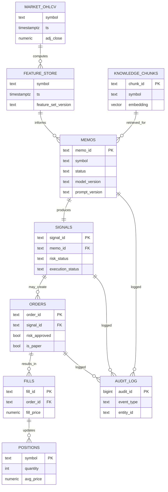

# Data Architecture — Mesa Proprietária com IA

**Project:** Proprietary AI-Powered Trading Desk (owner capital only).
**Companion to:** `system-architecture.md`, `technical-specification.md`, `agent-architecture.md`.
**Status:** MVP. Data quality gates are **trade-blocking** by design (fail-closed).

---

## 1. Data Sources & Ingestion (L01 → L02)

Ingestion modules pull from external providers behind interfaces (no provider imported directly elsewhere) and land **raw, unmodified** payloads in the Parquet lake.

| Source class | Module | Cadence | Lands in lake as |
|--------------|--------|---------|------------------|
| Prices (OHLCV) | `data/ingestion/prices.py` | daily (intraday later) | `raw/prices/...` |
| News | `data/ingestion/news.py` | intraday | `raw/news/...` |
| Fundamentals | `data/ingestion/fundamentals.py` | periodic | `raw/fundamentals/...` |
| Filings (e.g. SEC) | `data/ingestion/filings.py` | event-driven | `raw/filings/...` |
| Broker sync | `data/ingestion/broker_sync.py` | continuous | positions/fills → reconciliation |

**MVP universe (21 symbols):** SPY, QQQ, IWM, DIA, XLK, XLF, XLE, XLI, XLV, XLY, XLP, AAPL, MSFT, NVDA, AMZN, META, GOOGL, TSLA, JPM, V, MA.

---

## 2. Raw Data Lake Layout (L03 — Parquet)

Append-only, immutable, partitioned by source/symbol/date. Queried locally with **DuckDB**. Raw is never edited — corrections produce new partitions.

```
data_lake/
└── raw/
    ├── prices/
    │   └── symbol=AAPL/year=2026/month=06/day=19/part-000.parquet
    ├── news/
    │   └── symbol=AAPL/date=2026-06-19/part-000.parquet
    ├── fundamentals/
    │   └── symbol=AAPL/asof=2026-06-19/part-000.parquet
    └── filings/
        └── symbol=AAPL/type=10-Q/date=2026-06-19/part-000.parquet
```

| Property | Value |
|----------|-------|
| Format | Parquet (columnar, compressed) |
| Partitioning | `source / symbol / date` (Hive-style) |
| Mutability | Immutable (append-only) |
| Query engine | DuckDB (ad hoc + normalization reads) |
| Ingestion metadata | `_ingested_at`, `_source`, `_source_version` columns per file |

---

## 3. Normalization, Corporate Actions, Timestamps, Symbols (L04)

| Concern | Module | Rule |
|---------|--------|------|
| Symbols | `data/normalization/symbols.py` | Map vendor tickers → canonical symbol; reject unknown |
| Corporate actions | `data/normalization/corporate_actions.py` | Apply splits/dividends → adjusted OHLCV; keep raw + adjusted |
| Timestamps | `data/normalization/timestamps.py` | All timestamps stored **UTC**; market session normalization |
| Quality checks | `data/normalization/quality_checks.py` | Gate before market DB (see §9) |

Output of L04 is **canonical validated rows** ready for the market database and feature store.

---

## 4. Market Database — OHLCV Time-Series (L05)

PostgreSQL with **TimescaleDB hypertable** (preferred) or native partitioning fallback.

### 4.1 DDL — TimescaleDB hypertable

```sql
CREATE TABLE market_ohlcv (
    symbol          TEXT        NOT NULL,
    ts              TIMESTAMPTZ NOT NULL,        -- bar open, UTC
    timeframe       TEXT        NOT NULL,        -- '1d' (MVP), '1m' later
    open            NUMERIC(18,6) NOT NULL,
    high            NUMERIC(18,6) NOT NULL,
    low             NUMERIC(18,6) NOT NULL,
    close           NUMERIC(18,6) NOT NULL,
    adj_close       NUMERIC(18,6) NOT NULL,      -- corporate-action adjusted
    volume          BIGINT       NOT NULL,
    source          TEXT         NOT NULL,
    ingested_at     TIMESTAMPTZ  NOT NULL DEFAULT now(),
    CONSTRAINT pk_ohlcv PRIMARY KEY (symbol, timeframe, ts),
    CONSTRAINT chk_hl CHECK (high >= low),
    CONSTRAINT chk_vol CHECK (volume >= 0)
);

-- Convert to hypertable partitioned on time, space-partitioned by symbol
SELECT create_hypertable('market_ohlcv', 'ts',
                         partitioning_column => 'symbol',
                         number_partitions   => 4,
                         chunk_time_interval => INTERVAL '7 days');

CREATE INDEX idx_ohlcv_symbol_ts ON market_ohlcv (symbol, ts DESC);
```

### 4.2 DDL — Native PG partitioning fallback

```sql
CREATE TABLE market_ohlcv (
    symbol TEXT NOT NULL, ts TIMESTAMPTZ NOT NULL, timeframe TEXT NOT NULL,
    open NUMERIC(18,6), high NUMERIC(18,6), low NUMERIC(18,6),
    close NUMERIC(18,6), adj_close NUMERIC(18,6), volume BIGINT,
    source TEXT, ingested_at TIMESTAMPTZ DEFAULT now()
) PARTITION BY RANGE (ts);

CREATE TABLE market_ohlcv_2026_q2 PARTITION OF market_ohlcv
    FOR VALUES FROM ('2026-04-01') TO ('2026-07-01');
```

---

## 5. Feature Store (L05)

Computed deterministically from `market_ohlcv` by `features/*`, persisted for reuse by agents, signals and backtests.

```sql
CREATE TABLE feature_store (
    symbol        TEXT        NOT NULL,
    ts            TIMESTAMPTZ NOT NULL,
    timeframe     TEXT        NOT NULL,
    feature_set_version TEXT  NOT NULL,        -- reproducibility
    sma_20        NUMERIC(18,6),
    rsi_14        NUMERIC(9,4),
    atr_14        NUMERIC(18,6),
    realized_vol_20 NUMERIC(9,6),
    momentum_60   NUMERIC(9,6),
    avg_dollar_vol_20 NUMERIC(20,2),           -- liquidity
    spread_est    NUMERIC(9,6),                -- liquidity / cost
    computed_at   TIMESTAMPTZ NOT NULL DEFAULT now(),
    CONSTRAINT pk_feature PRIMARY KEY (symbol, timeframe, ts, feature_set_version)
);

CREATE INDEX idx_feature_symbol_ts ON feature_store (symbol, ts DESC);
```

| Feature module | Outputs |
|----------------|---------|
| `technical_indicators.py` | SMA/EMA, RSI, MACD |
| `volatility.py` | ATR, realized vol |
| `momentum.py` | N-day momentum |
| `liquidity.py` | avg dollar volume, spread estimate |
| `fundamentals.py` | normalized fundamental ratios |

---

## 6. Memos, Signals, Orders, Fills, Audit Log (DDL)

### 6.1 Memos

```sql
CREATE TABLE memos (
    memo_id        TEXT PRIMARY KEY,
    symbol         TEXT NOT NULL,
    asset_type     TEXT NOT NULL,             -- 'stock' | 'etf'
    direction      TEXT NOT NULL,             -- 'long' (MVP)
    thesis         TEXT NOT NULL,
    catalyst       TEXT NOT NULL,
    time_horizon   TEXT NOT NULL,
    entry_logic    TEXT NOT NULL,
    risk_summary   TEXT NOT NULL,
    skeptic_view   TEXT NOT NULL,             -- required red-team view
    confidence_score NUMERIC(4,3) NOT NULL CHECK (confidence_score BETWEEN 0 AND 1),
    data_sources   JSONB NOT NULL,
    created_at     TIMESTAMPTZ NOT NULL,
    model_version  TEXT NOT NULL,
    prompt_version TEXT NOT NULL,
    status         TEXT NOT NULL              -- 'draft'|'complete'|'rejected'
);
```

### 6.2 Signals

```sql
CREATE TABLE signals (
    signal_id        TEXT PRIMARY KEY,
    memo_id          TEXT NOT NULL REFERENCES memos(memo_id),
    symbol           TEXT NOT NULL,
    direction        TEXT NOT NULL,
    entry_type       TEXT NOT NULL,           -- 'market'|'limit'
    entry_price      NUMERIC(18,6) NOT NULL,
    stop_loss        NUMERIC(18,6) NOT NULL,
    take_profit      NUMERIC(18,6) NOT NULL,
    max_position_pct NUMERIC(5,2) NOT NULL CHECK (max_position_pct <= 2.0),
    max_risk_pct     NUMERIC(5,2) NOT NULL CHECK (max_risk_pct <= 1.0),
    time_horizon     TEXT NOT NULL,
    confidence_score NUMERIC(4,3) NOT NULL CHECK (confidence_score BETWEEN 0 AND 1),
    requires_backtest BOOLEAN NOT NULL DEFAULT TRUE,
    risk_status      TEXT NOT NULL DEFAULT 'pending',  -- pending|approved|blocked
    execution_status TEXT NOT NULL DEFAULT 'pending',
    created_at       TIMESTAMPTZ NOT NULL
);
CREATE INDEX idx_signals_status ON signals (risk_status, execution_status);
```

### 6.3 Orders

```sql
CREATE TABLE orders (
    order_id      TEXT PRIMARY KEY,
    signal_id     TEXT NOT NULL REFERENCES signals(signal_id),
    symbol        TEXT NOT NULL,
    side          TEXT NOT NULL,              -- 'buy' (MVP long-only)
    order_type    TEXT NOT NULL,              -- 'market'|'limit'
    quantity      INTEGER NOT NULL CHECK (quantity > 0),
    limit_price   NUMERIC(18,6),
    risk_approved BOOLEAN NOT NULL DEFAULT FALSE,   -- set only by risk engine
    is_paper      BOOLEAN NOT NULL DEFAULT TRUE,
    status        TEXT NOT NULL DEFAULT 'validated',
    created_at    TIMESTAMPTZ NOT NULL,
    CONSTRAINT chk_risk_approved CHECK (status = 'validated' OR risk_approved = TRUE)
);
```

### 6.4 Fills

```sql
CREATE TABLE fills (
    fill_id     TEXT PRIMARY KEY,
    order_id    TEXT NOT NULL REFERENCES orders(order_id),
    symbol      TEXT NOT NULL,
    quantity    INTEGER NOT NULL,
    fill_price  NUMERIC(18,6) NOT NULL,
    commission  NUMERIC(12,4) NOT NULL DEFAULT 0,
    slippage    NUMERIC(12,6) NOT NULL DEFAULT 0,
    is_paper    BOOLEAN NOT NULL DEFAULT TRUE,
    filled_at   TIMESTAMPTZ NOT NULL
);
```

### 6.5 Audit Log

```sql
CREATE TABLE audit_log (
    audit_id     BIGSERIAL PRIMARY KEY,
    timestamp    TIMESTAMPTZ NOT NULL DEFAULT now(),
    event_type   TEXT NOT NULL,               -- signal_created, risk_blocked, order_submitted, no_trade...
    entity_id    TEXT NOT NULL,               -- memo/signal/order/symbol
    severity     TEXT NOT NULL,               -- info|warning|error|critical
    model_version  TEXT,                       -- AI-origin events only
    prompt_version TEXT,                       -- AI-origin events only
    detail       JSONB
);
CREATE INDEX idx_audit_entity ON audit_log (entity_id, timestamp DESC);
CREATE INDEX idx_audit_event  ON audit_log (event_type, timestamp DESC);
```

The audit log is **append-only** (no UPDATE/DELETE in application code). A mirror JSONL stream is written by `core/logging.py`.

---

## 7. Knowledge Layer / RAG Vector Store (L06)

pgvector (MVP) or Qdrant (scale). Stores embeddings of news, filings, memos for retrieval-augmented agent reasoning.

```sql
CREATE EXTENSION IF NOT EXISTS vector;

CREATE TABLE knowledge_chunks (
    chunk_id     TEXT PRIMARY KEY,
    source_type  TEXT NOT NULL,               -- 'news'|'filing'|'fundamental'|'memo'
    symbol       TEXT,
    content      TEXT NOT NULL,
    embedding    VECTOR(1536) NOT NULL,
    metadata     JSONB NOT NULL,              -- {published_at, source, url...}
    embed_model_version TEXT NOT NULL,
    created_at   TIMESTAMPTZ NOT NULL DEFAULT now()
);

CREATE INDEX idx_knowledge_embedding
    ON knowledge_chunks USING ivfflat (embedding vector_cosine_ops)
    WITH (lists = 100);
CREATE INDEX idx_knowledge_symbol ON knowledge_chunks (symbol, source_type);
```

| Field | Role |
|-------|------|
| `embedding` | similarity search vector |
| `embed_model_version` | reproducibility of retrieval |
| `metadata` | filtering (recency, source, symbol) |

Qdrant equivalent: one collection `knowledge_chunks`, cosine distance, payload mirrors `metadata` + `source_type` + `symbol`.

---

## 8. Entity-Relationship Diagram



---

## 9. Data Quality Rules That Block Trading

`data/normalization/quality_checks.py` enforces gates **before** data reaches the market DB / signals. Any failure → symbol excluded → **no trade** for that symbol.

| Rule | Check | On failure |
|------|-------|-----------|
| Completeness | No gaps/missing bars in required window | block symbol |
| Sufficient history | Bars ≥ minimum for indicators | block signal |
| OHLC sanity | `high ≥ low`, prices > 0 | drop row + flag |
| Freshness | Latest bar within staleness threshold | block symbol |
| Liquidity | avg dollar volume ≥ floor | block signal |
| Spread | estimated spread ≤ ceiling | block signal |
| Corporate-action consistency | adj/raw reconcile after splits/divs | block symbol |
| Duplicate detection | no duplicate `(symbol,timeframe,ts)` | dedupe + flag |
| Timestamp validity | all UTC, monotonic per symbol | block symbol |

Every gate decision is written to `audit_log` with `event_type='quality_check'`.

---

## 10. Data Retention & Lineage

| Dataset | Retention | Mutability | Lineage anchor |
|---------|-----------|------------|----------------|
| Raw lake (Parquet) | Indefinite (immutable) | append-only | `_source`, `_source_version`, `_ingested_at` |
| `market_ohlcv` | Indefinite | upsert by PK | `source`, `ingested_at` |
| `feature_store` | Indefinite | versioned | `feature_set_version`, `computed_at` |
| `memos` / `signals` | Indefinite | status transitions | `model_version`, `prompt_version` |
| `orders` / `fills` | Indefinite | append-only | linked `signal_id` |
| `audit_log` | Indefinite | append-only | `entity_id`, timestamps |
| `knowledge_chunks` | Re-embeddable | versioned | `embed_model_version` |

**Lineage chain (fully traceable):**

```
raw Parquet → market_ohlcv → feature_store(version)
   → memo(model_version, prompt_version) → signal → order → fill → position
   ───────────────── audit_log records every transition ─────────────────
```

Any executed (paper) trade can be traced backward to the exact features, memo, prompt and model that produced it — satisfying the explainability and auditability principles.

---

*See also: `system-architecture.md`, `technical-specification.md`, `agent-architecture.md`.*
