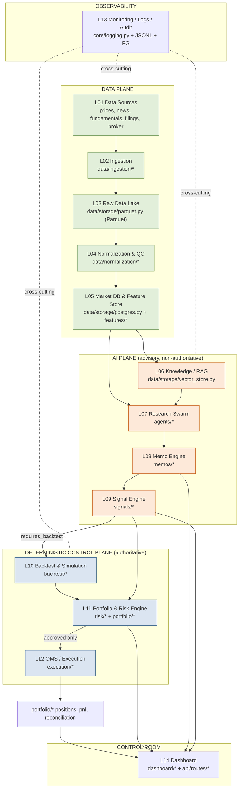
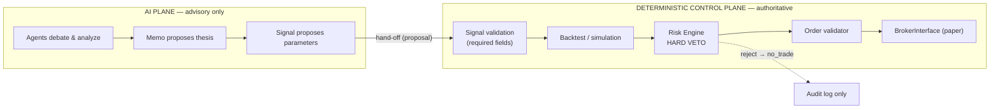
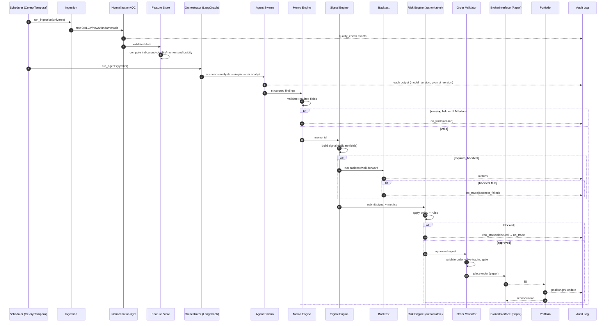
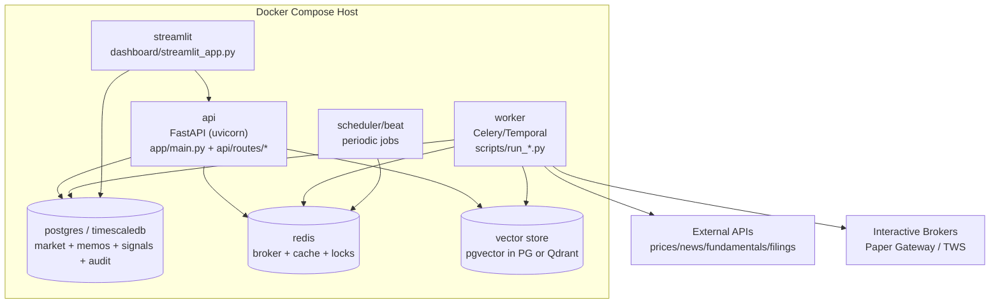

# System Architecture — Mesa Proprietária com IA

**Project:** Proprietary AI-Powered Trading Desk
**Scope:** Operates **only the owner's own capital**. This is **not** a fund, advisory service, or third-party asset management offering. No financial advice is produced.
**Method:** BMAD (Business-Model-Architecture-Delivery) — this document is the Architecture artifact.
**Status:** MVP design. Research / Backtest / Paper trading first. Live trading **disabled by default**.

---

## 1. Purpose and Guiding Principles

The system is a single-owner research, signal-generation and execution platform. It is built around one non-negotiable principle:

> **AI agents may research, analyze, debate, generate memos and propose signals — but MUST NOT directly execute trades.** Every order passes through a deterministic control plane: validation → backtest/simulation → risk limits → order validation → broker execution. **The Risk Engine has higher authority than every AI agent.**

### 1.1 Core Principles

| # | Principle | Architectural Consequence |
|---|-----------|---------------------------|
| 1 | AI cannot trade | A hard boundary separates the **AI plane** (non-authoritative) from the **deterministic control plane** (authoritative). |
| 2 | Risk authority is supreme | `risk/risk_engine.py` can veto any signal; no module can bypass it. |
| 3 | Fail closed | Any failure of data quality, broker, risk engine, or LLM provider results in **no trade**. |
| 4 | Everything explainable | Every memo and signal stores `model_version` + `prompt_version` and a full reasoning trail. |
| 5 | Everything auditable | Every trading action and AI decision is logged (JSONL + PostgreSQL). |
| 6 | Paper-first | `paper_trading_default=true`, `live_trading_default=false`. |
| 7 | Minimal MVP surface | Long-only US stocks & ETFs; no leverage / options / crypto / shorts. |

### 1.2 Safety & Scope Constraints (MVP)

- No live trading initially — start with research, backtest, paper trading.
- No leverage, options, crypto, or shorting.
- Long-only US stocks & ETFs.
- A signal is **rejected if any required field is missing**.
- If data quality / broker / risk engine / LLM provider fails → **no trade**.

---

## 2. High-Level Architecture Overview

The platform is structured as **14 layers** grouped into four conceptual planes:

```
┌──────────────────────────────────────────────────────────────────────────────┐
│                          CONTROL ROOM PLANE (humans)                           │
│  Layer 14  Dashboard / Control Room (Streamlit MVP → Next.js later)            │
└──────────────────────────────────────────────────────────────────────────────┘
            ▲                                                       ▲
            │ read / approve                                        │ observe
┌───────────┴───────────────────────────┐   ┌───────────────────────┴───────────┐
│         AI PLANE (advisory)            │   │   DETERMINISTIC CONTROL PLANE      │
│ (non-authoritative — proposes only)    │   │   (authoritative — decides)        │
│                                        │   │                                    │
│ L06 Knowledge / RAG                    │   │ L10 Backtest & Simulation          │
│ L07 Multi-Agent Research Swarm         │   │ L11 Portfolio & Risk Engine ◀ TOP  │
│ L08 Investment Memo Engine             │   │ L12 OMS / Execution Engine         │
│ L09 Signal Engine                      │   │                                    │
└────────────────────────────────────────┘   └────────────────────────────────────┘
            ▲                                                       │
            │ features                                              │ fills / positions
┌───────────┴────────────────────────────────────────────────────┴───────────────┐
│                              DATA PLANE                                          │
│ L01 Data Sources → L02 Ingestion → L03 Raw Lake → L04 Normalization & QC →       │
│ L05 Market DB & Feature Store                                                    │
└─────────────────────────────────────────────────────────────────────────────────┘
                          │
                          ▼
                L13 Monitoring / Logs / Audit Trail (cross-cutting)
```

---

## 3. Layer-to-Module Component Diagram



### 3.1 Layer → Repository Module Mapping

| Layer | Name | Primary Modules |
|-------|------|-----------------|
| 01 | Data Sources | external APIs behind `data/ingestion/*` interfaces |
| 02 | Data Ingestion | `data/ingestion/{prices,news,fundamentals,filings,broker_sync}.py` |
| 03 | Raw Data Lake | `data/storage/parquet.py` |
| 04 | Normalization & QC | `data/normalization/{symbols,corporate_actions,timestamps,quality_checks}.py` |
| 05 | Market DB & Feature Store | `data/storage/postgres.py`, `features/*` |
| 06 | Knowledge Layer / RAG | `data/storage/vector_store.py` |
| 07 | Multi-Agent Research Swarm | `agents/*` + `agents/prompts/*.md` |
| 08 | Investment Memo Engine | `memos/{memo_schema,memo_generator,memo_repository}.py` |
| 09 | Signal Engine | `signals/{signal_schema,signal_engine,signal_repository,ranking}.py` |
| 10 | Backtesting & Simulation | `backtest/{engine,simulator,metrics,slippage,walk_forward,reports}.py` |
| 11 | Portfolio & Risk Engine | `risk/*`, `portfolio/*` |
| 12 | OMS / Execution | `execution/*` |
| 13 | Monitoring / Logs / Audit | `core/{logging,events,exceptions}.py` + JSONL/PG sinks |
| 14 | Dashboard / Control Room | `dashboard/*`, `api/routes/*` |

---

## 4. End-to-End Data Flow

```
ingestion → raw lake → normalization → quality checks → market DB
   → feature store → knowledge/RAG → research swarm → memo → signal
      → (requires_backtest?) → backtest/simulation → risk engine
         → order validation → broker (paper) → fills → portfolio → dashboard
```

Each arrow is a **gate**. If a gate cannot be satisfied (missing data, failed QC, failed backtest, risk veto, broker down), the pipeline halts at that gate and emits a `no_trade` audit event. Nothing downstream of a failed gate executes.

| Stage | Input | Output | Gate Condition |
|-------|-------|--------|----------------|
| Ingestion | external API | raw Parquet | source reachable |
| Normalization | raw Parquet | canonical rows | symbol/timestamp/CA resolved |
| Quality checks | canonical rows | validated rows | QC pass |
| Feature store | OHLCV | indicators | sufficient history |
| Research swarm | features + RAG | agent outputs | LLM available |
| Memo engine | agent outputs | memo (all fields) | no missing field |
| Signal engine | memo | signal (all fields) | no missing field |
| Backtest | signal | metrics | backtest pass |
| Risk engine | signal + metrics | approved/blocked | all risk rules pass |
| Execution | approved signal | order/fill | broker connected + live approved |

---

## 5. Deterministic Control Plane vs AI Plane

This separation is the heart of the architecture.



| Property | AI Plane | Deterministic Control Plane |
|----------|----------|-----------------------------|
| Nature | Probabilistic (LLM) | Rule-based, deterministic |
| Authority | None (proposes) | Final (decides / executes) |
| Can place orders? | **No** | Yes, only after risk approval |
| Can be overridden? | Always | Risk engine cannot be overridden by AI |
| Reproducible | Versioned but stochastic | Deterministic given same inputs |
| Failure behavior | Degrade → no signal | Fail closed → no trade |

**Risk Engine supremacy:** The Risk Analyst *agent* may *suggest* but cannot *approve*. Approval is exclusively the deterministic `risk/risk_engine.py`.

---

## 6. Failure-Mode Handling (Fail-Closed Matrix)

| Failure | Detected By | System Response | Trade Outcome |
|---------|-------------|-----------------|---------------|
| Data source unreachable | `data/ingestion/*` | retry → mark stale | **No trade** |
| Data quality failure | `data/normalization/quality_checks.py` | block symbol | **No trade** |
| Insufficient price history | feature store | flag signal | **No trade** |
| Low liquidity / high spread | `features/liquidity.py` + risk rules | risk block | **No trade** |
| Backtest failure | `backtest/engine.py` | mark signal failed | **No trade** |
| Position/exposure limit breach | `risk/rules.py` | risk block | **No trade** |
| Daily/weekly loss breach | `risk/drawdown.py` | kill switch | **No trade (halt)** |
| Max open positions breach | `risk/exposure.py` | risk block | **No trade** |
| Broker connection failure | `execution/ibkr_client.py` | order rejected | **No trade** |
| Unapproved live trading | `execution/order_validator.py` | order rejected | **No trade** |
| LLM provider failure / uncertainty | `agents/orchestrator.py` | abort swarm | **No memo / no trade** |
| Incomplete thesis | `memos/memo_generator.py` | memo invalid | **No signal** |

The global circuit breaker is `risk/kill_switch.py`. When tripped (loss limits, repeated broker errors), it disables order submission across the whole OMS until manually reset from the Control Room.

---

## 7. Full Decision Lifecycle — Sequence Diagram



---

## 8. Deployment View (Docker Compose — MVP)



### 8.1 Services

| Service | Image basis | Responsibility | Key deps |
|---------|-------------|----------------|----------|
| `api` | python:3.12 + FastAPI | REST surface, read/approve actions | postgres, redis, vector |
| `worker` | python:3.12 + Celery/Temporal | ingestion, agents, backtest, paper trading | postgres, redis, vector, IBKR, external APIs |
| `scheduler` | beat/temporal-cron | periodic triggers | redis |
| `postgres` | postgres:16 + TimescaleDB | market DB, feature store, memos, signals, orders, fills, audit | — |
| `redis` | redis:7 | Celery broker, cache, distributed locks | — |
| `vector` | pgvector (in PG) or Qdrant | RAG embeddings | — |
| `streamlit` | python:3.12 + Streamlit | MVP control room | api, postgres |

Secrets are injected via environment variables (`.env`, never committed); only `.env.example` lives in the repo. `LIVE_TRADING_ENABLED=false` by default.

---

## 9. Technology Choices & Rationale

| Concern | Choice | Rationale |
|---------|--------|-----------|
| Language | Python 3.12 | Quant/ML ecosystem, type hints, async |
| API | FastAPI | Async, Pydantic-native, OpenAPI auto-docs |
| Schemas | Pydantic | Strict validation = enforces required memo/signal fields |
| OLTP DB | PostgreSQL | Reliable, transactional, mature |
| Time-series | TimescaleDB (hypertable) or PG partitioning | Efficient OHLCV storage & range queries |
| Cache / broker | Redis | Fast cache, Celery broker, distributed locks |
| Orchestration | Celery (MVP) / Temporal (later) | Background jobs; Temporal adds durable workflows |
| Analytics lake | Parquet + DuckDB | Columnar, cheap, fast local analytics |
| Agent orchestration | LangGraph | Explicit stateful multi-agent graphs |
| Vector store | pgvector (MVP) / Qdrant (scale) | RAG; pgvector keeps infra minimal early |
| Backtest | Custom lightweight engine | Determinism & full control; Backtrader optional later |
| Broker | Interactive Brokers (paper first) | Robust API, paper environment |
| Dashboard | Streamlit (MVP) → Next.js | Fast MVP UI; richer SPA later |
| Logging | JSONL + PostgreSQL | Append-only audit + queryable store |
| Telemetry | OpenTelemetry-ready | Future tracing/metrics |
| Packaging | Docker Compose | Reproducible single-host MVP |

---

## 10. Scalability & Future Considerations

| Dimension | MVP | Future |
|-----------|-----|--------|
| UI | Streamlit | Next.js SPA + FastAPI backend |
| Trading mode | Paper (IBKR) | **Controlled** live trading, gated behind explicit approval + extended risk rules |
| Orchestration | Celery on Redis | Temporal durable workflows |
| Vector store | pgvector | Qdrant cluster |
| Time-series | single PG/Timescale node | partition tiering / read replicas |
| Universe | 21 symbols (US stocks/ETFs) | broader equities, then (gated) options/futures |
| Agents | 8 MVP agents | additional specialist agents, tool calling |
| Deploy | Docker Compose | Kubernetes, horizontal worker scaling |

**Live-trading enablement path (future):** enable only after (1) sustained paper-trading track record, (2) extended risk rules (earnings, gap, sector caps), (3) reconciliation parity, (4) explicit `LIVE_TRADING_ENABLED=true` plus per-order live approval. The architecture keeps live trading behind the same deterministic control plane — no new bypass is ever introduced for the AI plane.

---

## 11. Cross-Cutting Concerns

- **Auditability (L13):** every trading action and AI decision is logged with `timestamp / event_type / entity_id / severity`. AI outputs additionally store `model_version` + `prompt_version`.
- **Explainability:** each signal links to a memo carrying the full thesis, catalyst, skeptic view and data sources.
- **Security:** no hardcoded API keys; all external APIs behind interfaces; all broker actions behind `BrokerInterface`; all orders require risk approval.
- **Determinism:** the control plane is reproducible given identical inputs; the AI plane is versioned for traceability even though stochastic.

---

*See also: `technical-specification.md`, `data-architecture.md`, `agent-architecture.md`.*
