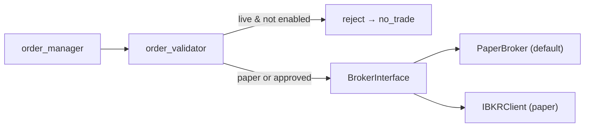
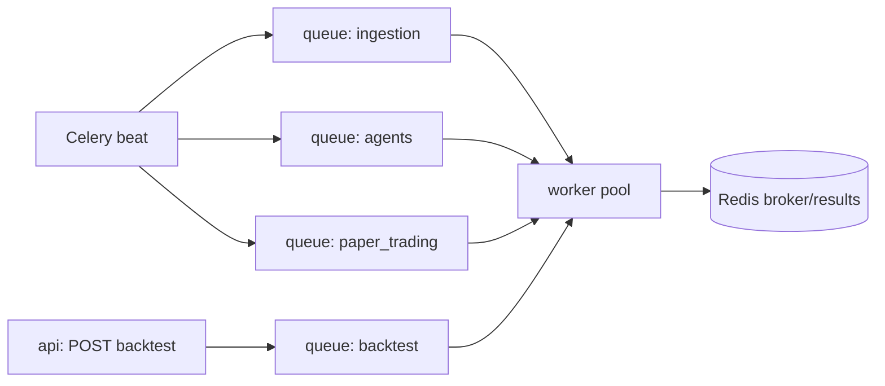

# Technical Specification — Mesa Proprietária com IA

**Project:** Proprietary AI-Powered Trading Desk (owner capital only — not a fund/advisory).
**Companion to:** `system-architecture.md`, `data-architecture.md`, `agent-architecture.md`.
**Status:** MVP. Paper trading default. `LIVE_TRADING_ENABLED=false`.

---

## 1. Module-by-Module Responsibilities

### 1.1 `app/` — Application bootstrap

| Module | Responsibility |
|--------|----------------|
| `app/main.py` | FastAPI app factory, router registration, startup/shutdown hooks |
| `app/config.py` | Pydantic `Settings` loaded from env (`.env`), typed config, defaults |
| `app/dependencies.py` | DI providers: DB session, Redis, repositories, risk engine, broker |

### 1.2 `core/` — Cross-cutting primitives

| Module | Responsibility |
|--------|----------------|
| `core/events.py` | Domain event types (`SignalCreated`, `OrderFilled`, `RiskBlocked`, `NoTrade`) |
| `core/exceptions.py` | Typed exception hierarchy (see §7) |
| `core/logging.py` | Structured logging contract → JSONL + PostgreSQL sink |
| `core/clock.py` | Single source of time (UTC), backtest-injectable clock |

### 1.3 `data/` — Data plane

| Subpackage | Modules | Responsibility |
|------------|---------|----------------|
| `data/ingestion/` | `prices, news, fundamentals, filings, broker_sync` | Pull from external sources behind interfaces → raw lake |
| `data/normalization/` | `symbols, corporate_actions, timestamps, quality_checks` | Canonicalize symbols, adjust for CA, normalize timestamps, gate quality |
| `data/storage/` | `postgres, parquet, vector_store` | Persistence adapters: OLTP/time-series, Parquet lake, embeddings |

### 1.4 `features/` — Feature store computation

`technical_indicators.py`, `volatility.py`, `momentum.py`, `liquidity.py`, `fundamentals.py` — pure, deterministic feature functions consumed by agents and signals.

### 1.5 `agents/` — AI plane (see `agent-architecture.md`)

`base_agent.py`, `orchestrator.py`, and 7 specialist agents + `agents/prompts/*.md`. **Advisory only — cannot execute.**

### 1.6 `memos/`, `signals/`

| Module | Responsibility |
|--------|----------------|
| `memos/memo_schema.py` | Pydantic `InvestmentMemo` (required fields enforced) |
| `memos/memo_generator.py` | Assemble memo from agent outputs; reject if incomplete |
| `memos/memo_repository.py` | Persist/query memos |
| `signals/signal_schema.py` | Pydantic `Signal` model |
| `signals/signal_engine.py` | Convert memo → signal; field validation |
| `signals/signal_repository.py` | Persist/query signals |
| `signals/ranking.py` | Rank/prioritize candidate signals |

### 1.7 `backtest/` — Deterministic simulation

`engine.py` (core loop), `simulator.py` (paper-style fills), `metrics.py` (Sharpe, drawdown, hit-rate), `slippage.py`, `walk_forward.py`, `reports.py`.

### 1.8 `risk/` — Authoritative control

| Module | Responsibility |
|--------|----------------|
| `risk/policy.py` | The `RiskPolicy` (limits & flags) |
| `risk/rules.py` | Individual deterministic rule predicates |
| `risk/position_sizing.py` | Size from `max_risk_per_trade` + stop distance |
| `risk/exposure.py` | Aggregate exposure & open-position checks |
| `risk/drawdown.py` | Daily/weekly loss tracking |
| `risk/kill_switch.py` | Global circuit breaker |
| `risk/risk_engine.py` | **Sole approval authority**; orchestrates all rules |

### 1.9 `execution/` — OMS

`broker_interface.py` (abstraction), `ibkr_client.py`, `order_schema.py`, `order_manager.py`, `order_validator.py`, `fill_handler.py`, `portfolio_sync.py`, `paper_trading.py` (default broker impl).

### 1.10 `portfolio/`

`positions.py`, `pnl.py`, `allocation.py`, `reconciliation.py`.

### 1.11 `dashboard/`, `api/`

Streamlit pages (`overview, signals, memos, risk, orders`) and FastAPI routers (`health, signals, memos, orders, portfolio, risk`).

---

## 2. Key Pydantic Models

### 2.1 Investment Memo (`memos/memo_schema.py`)

```python
from datetime import datetime
from enum import Enum
from pydantic import BaseModel, Field

class Direction(str, Enum):
    long = "long"          # MVP: long-only

class MemoStatus(str, Enum):
    draft = "draft"
    complete = "complete"
    rejected = "rejected"

class InvestmentMemo(BaseModel):
    memo_id: str
    symbol: str
    asset_type: str                     # "stock" | "etf"
    direction: Direction
    thesis: str
    catalyst: str
    time_horizon: str
    entry_logic: str
    risk_summary: str
    skeptic_view: str                   # Red-Team counter-argument (required)
    confidence_score: float = Field(ge=0.0, le=1.0)
    data_sources: list[str]
    created_at: datetime
    model_version: str                  # explainability
    prompt_version: str                 # explainability
    status: MemoStatus
```

A memo is **rejected** (status `rejected`, `NoTrade` event) if any required field is missing or empty.

### 2.2 Signal (`signals/signal_schema.py`)

```python
from datetime import datetime
from enum import Enum
from pydantic import BaseModel, Field

class EntryType(str, Enum):
    market = "market"
    limit = "limit"

class RiskStatus(str, Enum):
    pending = "pending"
    approved = "approved"
    blocked = "blocked"

class ExecutionStatus(str, Enum):
    pending = "pending"
    submitted = "submitted"
    filled = "filled"
    rejected = "rejected"
    no_trade = "no_trade"

class Signal(BaseModel):
    signal_id: str
    memo_id: str
    symbol: str
    direction: str                      # "long" in MVP
    entry_type: EntryType
    entry_price: float
    stop_loss: float
    take_profit: float
    max_position_pct: float = Field(le=2.0)   # policy ceiling
    max_risk_pct: float = Field(le=1.0)        # policy ceiling
    time_horizon: str
    confidence_score: float = Field(ge=0.0, le=1.0)
    requires_backtest: bool = True
    risk_status: RiskStatus = RiskStatus.pending
    execution_status: ExecutionStatus = ExecutionStatus.pending
    created_at: datetime
```

### 2.3 Order (`execution/order_schema.py`)

```python
from datetime import datetime
from enum import Enum
from pydantic import BaseModel

class OrderSide(str, Enum):
    buy = "buy"          # MVP long-only; no short/sell-to-open

class OrderType(str, Enum):
    market = "market"
    limit = "limit"

class OrderStatus(str, Enum):
    validated = "validated"
    submitted = "submitted"
    partially_filled = "partially_filled"
    filled = "filled"
    rejected = "rejected"
    cancelled = "cancelled"

class Order(BaseModel):
    order_id: str
    signal_id: str
    symbol: str
    side: OrderSide
    order_type: OrderType
    quantity: int
    limit_price: float | None = None
    risk_approved: bool = False        # MUST be True before submission
    is_paper: bool = True              # paper by default
    status: OrderStatus = OrderStatus.validated
    created_at: datetime
```

> **Invariant:** `order_manager.submit()` raises `RiskApprovalMissingError` unless `risk_approved is True`. The AI plane never sets this flag — only `risk/risk_engine.py` does.

---

## 3. BrokerInterface Abstraction & Paper-Trading Default

All broker actions go through one interface. No module imports a concrete broker directly.

```python
from abc import ABC, abstractmethod
from execution.order_schema import Order

class BrokerInterface(ABC):
    @abstractmethod
    def connect(self) -> None: ...
    @abstractmethod
    def is_connected(self) -> bool: ...
    @abstractmethod
    def place_order(self, order: Order) -> "BrokerAck": ...
    @abstractmethod
    def cancel_order(self, order_id: str) -> None: ...
    @abstractmethod
    def get_positions(self) -> list["BrokerPosition"]: ...
    @abstractmethod
    def get_account(self) -> "BrokerAccount": ...
```

| Implementation | When used |
|----------------|-----------|
| `execution/paper_trading.PaperBroker` | **Default** (`PAPER_TRADING=true`). In-process simulated fills via `backtest/simulator.py` + `slippage.py`. |
| `execution/ibkr_client.IBKRClient` | IBKR **paper** gateway (and, later, gated live). |

Broker selection is resolved in `app/dependencies.py`: if `LIVE_TRADING_ENABLED=false` (default), live IBKR submission is impossible — `order_validator.py` rejects any non-paper order.



---

## 4. API Endpoints

Base path `/api`. All responses JSON. Read-heavy MVP; the only state-changing trading endpoint requires prior risk approval and is paper-gated.

| Method | Path | Router | Purpose |
|--------|------|--------|---------|
| GET | `/health` | `health.py` | Liveness/readiness (DB, Redis, broker, vector) |
| GET | `/health/dependencies` | `health.py` | Per-dependency status detail |
| GET | `/signals` | `signals.py` | List signals (filter by status/symbol) |
| GET | `/signals/{signal_id}` | `signals.py` | Signal detail + linked memo |
| POST | `/signals/{signal_id}/backtest` | `signals.py` | Trigger backtest job |
| GET | `/memos` | `memos.py` | List memos |
| GET | `/memos/{memo_id}` | `memos.py` | Memo detail (full thesis, versions) |
| GET | `/orders` | `orders.py` | List orders & statuses |
| GET | `/orders/{order_id}` | `orders.py` | Order detail + fills |
| POST | `/orders` | `orders.py` | Submit order — **requires `risk_approved`, paper-gated** |
| GET | `/portfolio` | `portfolio.py` | Positions, PnL, exposure |
| GET | `/portfolio/reconciliation` | `portfolio.py` | Broker vs internal reconciliation |
| GET | `/risk` | `risk.py` | Current policy, limits, utilization |
| GET | `/risk/status` | `risk.py` | Kill-switch state, breaches |
| POST | `/risk/evaluate` | `risk.py` | Evaluate a signal against rules (no execution) |

`POST /orders` flow: validate fields → confirm `risk_approved` flag set by risk engine → confirm `is_paper` or live-enabled → `order_validator` → `BrokerInterface`. Failing any check returns `409`/`422` and emits a `NoTrade` audit event.

---

## 5. Configuration & Environment Variables

Loaded via `app/config.py` (`pydantic-settings`). Only `.env.example` is committed; **no secrets in the repo**.

| Variable | Default | Purpose |
|----------|---------|---------|
| `ENV` | `dev` | Environment name |
| `LIVE_TRADING_ENABLED` | `false` | **Master live-trading gate** |
| `PAPER_TRADING` | `true` | Use PaperBroker by default |
| `DATABASE_URL` | — | PostgreSQL/TimescaleDB DSN |
| `REDIS_URL` | — | Redis DSN (Celery broker + cache) |
| `VECTOR_STORE` | `pgvector` | `pgvector` or `qdrant` |
| `QDRANT_URL` | — | Qdrant endpoint (if used) |
| `IBKR_HOST` / `IBKR_PORT` | `127.0.0.1` / `7497` | IBKR paper gateway |
| `LLM_PROVIDER` | `mock` | `mock` first (Phase 3), then real provider |
| `LLM_API_KEY` | — | LLM credential (env only) |
| `MODEL_VERSION` | — | Recorded on every AI output |
| `PROMPT_VERSION` | — | Recorded on every AI output |
| `MAX_RISK_PER_TRADE_PCT` | `1.0` | Risk policy override |
| `MAX_POSITION_SIZE_PCT` | `2.0` | Risk policy override |
| `MAX_DAILY_LOSS_PCT` | `2.0` | Risk policy override |
| `MAX_WEEKLY_LOSS_PCT` | `5.0` | Risk policy override |
| `MAX_OPEN_POSITIONS` | `3` | Risk policy override |
| `MAX_TOTAL_EXPOSURE_PCT` | `20.0` | Risk policy override |
| `LOG_LEVEL` | `INFO` | Logging verbosity |
| `OTEL_EXPORTER_OTLP_ENDPOINT` | — | OpenTelemetry (optional) |

The risk policy defaults are also hard-defaulted in `risk/policy.py`; env vars can only **tighten** within safe bounds in MVP, and the boolean permissions (`allow_short/options/crypto/leverage`) are **forced `false`** regardless of env.

---

## 6. Job / Queue Design

MVP uses **Celery on Redis**; the design is workflow-agnostic so **Temporal** can replace it later for durable, retryable workflows.

| Job | Script | Trigger | Description |
|-----|--------|---------|-------------|
| Ingestion | `scripts/run_ingestion.py` | scheduled (beat) | Pull prices/news/fundamentals/filings → lake → QC → market DB |
| Agent run | `scripts/run_agents.py` | scheduled / manual | Run LangGraph swarm → memos |
| Backtest | `scripts/run_backtest.py` | per signal / manual | Run backtest + walk-forward → metrics |
| Paper trading | `scripts/run_paper_trading.py` | scheduled | Drive approved signals through PaperBroker |



Design rules: idempotent tasks keyed by `(symbol, trading_day)`; Redis distributed locks prevent duplicate runs; retries with backoff for transient source errors; a terminal failure emits `NoTrade` rather than proceeding. Temporal migration would map each script to a durable workflow with the same gate semantics.

---

## 7. Error Handling & Exceptions

Hierarchy in `core/exceptions.py`:

```text
TradingDeskError (base)
├── DataError
│   ├── DataSourceUnavailableError
│   ├── DataQualityError
│   └── InsufficientHistoryError
├── AgentError
│   ├── LLMProviderError
│   └── IncompleteThesisError
├── ValidationError
│   ├── MissingRequiredFieldError
│   └── BacktestFailedError
├── RiskError
│   ├── RiskLimitBreachError
│   ├── KillSwitchActiveError
│   └── RiskApprovalMissingError
└── ExecutionError
    ├── BrokerConnectionError
    └── LiveTradingDisabledError
```

**Universal rule:** any unhandled or trading-relevant exception resolves to a `NoTrade` outcome plus an audit event. The system never "guesses" past a failure.

| Exception | Raised by | Result |
|-----------|-----------|--------|
| `DataQualityError` | quality_checks | symbol blocked, no trade |
| `IncompleteThesisError` | memo_generator | memo rejected |
| `MissingRequiredFieldError` | signal_engine | signal rejected |
| `BacktestFailedError` | backtest engine | signal blocked |
| `RiskLimitBreachError` | risk_engine | signal blocked |
| `KillSwitchActiveError` | kill_switch | all execution halted |
| `RiskApprovalMissingError` | order_manager | order rejected |
| `LiveTradingDisabledError` | order_validator | order rejected |
| `BrokerConnectionError` | ibkr_client | order rejected |
| `LLMProviderError` | orchestrator | swarm aborted, no memo |

---

## 8. Logging Contract

Every log record (JSONL file + `audit_log` PG table) carries at minimum:

| Field | Type | Notes |
|-------|------|-------|
| `timestamp` | ISO-8601 UTC | from `core/clock.py` |
| `event_type` | string | e.g. `signal_created`, `risk_blocked`, `order_submitted`, `no_trade` |
| `entity_id` | string | memo_id / signal_id / order_id / symbol |
| `severity` | enum | `debug`/`info`/`warning`/`error`/`critical` |

AI-origin events additionally include `model_version` and `prompt_version`. Trading-action events are **append-only** and never mutated.

```python
log.emit(
    event_type="risk_blocked",
    entity_id=signal.signal_id,
    severity="warning",
    detail={"rule": "max_open_positions", "limit": 3, "current": 3},
)
```

---

## 9. Versioning of Models & Prompts

- Each agent prompt lives in `agents/prompts/<agent>.md` and carries a `prompt_version`.
- `MODEL_VERSION` and `PROMPT_VERSION` are captured on every memo and signal and persisted.
- Replaying any historical decision is possible by retrieving the stored versions plus inputs.
- Bumping a prompt or model version is a tracked change; old memos retain their original versions for audit integrity.

---

## 10. Test Strategy Overview

| Layer | Location | Focus |
|-------|----------|-------|
| Unit | `tests/unit` | Pydantic validation, feature math, **risk rules (written before execution code)**, exception mapping |
| Integration | `tests/integration` | Ingestion→QC→DB, signal→risk→order pipeline, BrokerInterface contract, API routes |
| Backtest | `tests/backtest` | Engine determinism, slippage, walk-forward, metrics |

**Mandated ordering (coding standard):** tests for risk rules exist **before** execution code. Critical safety assertions covered by tests:

1. A signal with any missing required field is rejected.
2. An order without `risk_approved=True` cannot be submitted.
3. A live order with `LIVE_TRADING_ENABLED=false` is rejected.
4. Each risk limit breach (position, exposure, daily/weekly loss, open positions) blocks.
5. Broker/LLM/data failure → `NoTrade`.
6. `allow_short/options/crypto/leverage` cannot be enabled in MVP.

---

*See also: `system-architecture.md`, `data-architecture.md`, `agent-architecture.md`.*
